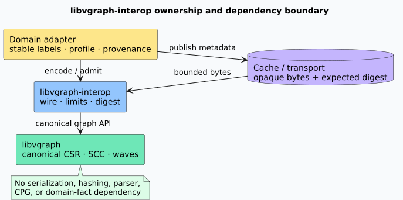
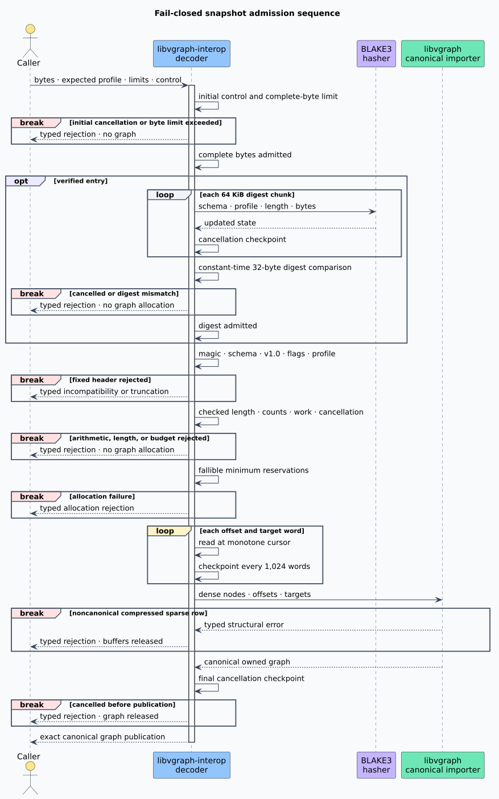

# Interchange boundary architecture

This document defines the ownership, dependency, and trust boundaries of
`libvgraph-interop` version 1.0.

## Terms

A **canonical CSR graph** is a dense directed graph whose compressed sparse row offsets are
nondecreasing and whose target values are strictly increasing within every source row. A
**snapshot** is the exact versioned byte representation of the canonical forward CSR. A
**semantic profile identifier** is an opaque 32-byte value naming the external interpretation of
the dense vertices and edges. **Admission** is the complete fail-closed process that turns
untrusted bytes into an immutable `CsrGraph<DenseId>`.

## Dependency direction



The dependency graph is one-way:

```text
domain adapter ──▶ libvgraph-interop ──▶ libvgraph
```

| Layer | Owns | Explicitly excludes |
|---|---|---|
| `libvgraph` | Canonical CSR, traversal, SCC, quotient, condensation, wavefronts | Wire schemas, digests, domain facts |
| `libvgraph-interop` | Snapshot grammar, compatibility, admission, limits, digesting | Stable labels, CPG semantics, parser policy, graph algorithms |
| Domain adapter | Stable-label maps, semantic-profile construction, provenance | A second CSR or SCC implementation |
| Cache or transport | Opaque bytes and an authenticated expected digest | Permission to reinterpret profiles or bypass admission |

This separation prevents a serialization dependency from entering graph-analysis hot loops and
prevents a domain schema from becoming a hidden property of the structural graph kernel.

## Encoder path

Safe `CsrGraph` constructors establish canonicality and keep all representation fields private.
The encoder therefore consumes that type invariant directly instead of repeating the core's
linear validator. It computes the exact output length with checked arithmetic, requests its
minimum capacity in one fallible reservation, and emits the fixed header, offsets, and targets
sequentially. The initialized output length is exact; allocator-dependent capacity may be larger.

Stable labels and reverse CSR are absent. Reverse CSR is derivable in linear work, while stable
labels require a domain-owned codec and ordering policy.

## Decoder path



The decoder proceeds through explicit flat stages:

1. Enforce the complete-slice byte limit and cancellation.
2. Check magic, schema, exact version, zero flags, and semantic profile.
3. Derive exact payload and wire lengths with checked arithmetic.
4. Check actual length, vertex and edge limits, and deterministic work admission.
5. Request the minimum capacity for request-local arrays with fallible allocation.
6. Read every word through a monotonically advancing cursor.
7. Ask `libvgraph`'s canonical import constructor to validate offsets, targets, and row order once.
   This one linear, stack-safe core scan has no cancellation callback.
8. Observe cancellation after core validation at the publication boundary and return the graph.

No malformed path returns a partial graph. Request-local vectors are dropped iteratively by the
standard flat `Vec` representation.

## Verified decoder path

The verified entry point first enforces the byte limit, then streams the bounded slice through
BLAKE3 in 64 KiB cancellation chunks. It compares the result with BLAKE3's constant-time `Hash`
equality. Only an exact digest proceeds to structural admission. This order avoids allocating CSR
arrays for stale cache entries while preserving the same final graph contract.

## Concurrency

The crate has no global registry, interner, cache, lock, executor, or mutable singleton. Every
request owns its cursor, buffers, limits, and control value. Immutable profiles, digests, input
slices, and returned graphs are shareable under their Rust type bounds. Parallelism belongs at the
request level; an individual sequential CSR pass remains deterministic and bandwidth-friendly.

## Compatibility

The reader accepts exactly schema `LVGI-CSR-FWD-V1!`, version 1.0, and flags zero. Unknown minor
versions are rejected rather than optimistically parsed. A future schema requires a new identity,
golden vectors, malformed corpus, decoder, and explicit migration through a validated graph value.
Rust API compatibility and persisted-byte compatibility are reviewed independently.
