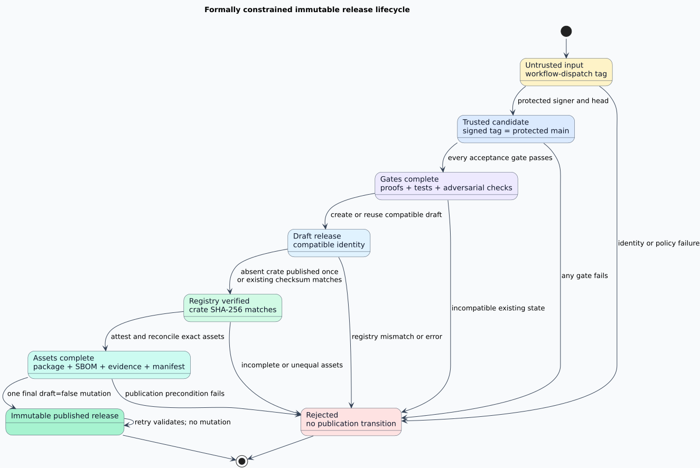

# Immutable release process

This document defines the only supported path from a `libvgraph-interop` source commit to a
crates.io version and an immutable GitHub release. Shared terms, including software bill of
materials (SBOM), OpenID Connect (OIDC), and minimum supported Rust version (MSRV), are defined in
the [glossary](../glossary.md).



## Trust roots and candidate identity

An operator dispatches `.github/workflows/release.yml` from `main` with an existing annotated tag.
The workflow first checks out the dispatch commit as protected policy. Before it checks out or
executes candidate code, it reads `.github/allowed_signers` only from that policy checkout,
requires canonical Semantic Versioning 2.0.0 tag syntax, and verifies the tag's SSH signature. It then
checks out the verified tag's peeled commit and requires equality among four identities:

1. the signed tag's peeled commit;
2. the workflow-dispatch commit in `GITHUB_SHA`;
3. the protected-policy checkout's `HEAD`; and
4. the candidate checkout's `HEAD`.

Any inequality rejects the run before candidate code executes. Branch protection makes the
dispatch commit the reviewed `main` policy; the signed annotated tag binds that same commit to the
version name.

## Verified transition order

The release state machine was model-checked before the workflow was implemented. Its production
refinement admits one path:

```text
protected signer, protected main, and exact formal-source binding
→ explicit portable tool closure and complete gates
→ compatible draft
→ equal crates.io checksum
→ complete assets
→ immutable publication
```

The complete gates first verify the bootstrap command set, then verify the complete command and
pinned-plugin closure after provisioning. They include formal provenance, all 76
formal-to-production mappings, formatting, compilation, strict Clippy, tests, doctests, rustdoc,
dependency policy, workflow policy, documentation, package inventory, 100,000 arbitrary-byte fuzz
executions, mutation testing with no survivor or timeout, and all four performance workloads. Each
command writes its complete output below repository-backed `target/verification`.

After the gates pass, the workflow generates a CycloneDX 1.5 JSON SBOM with
[`cargo-cyclonedx` 0.5.9](https://docs.rs/crate/cargo-cyclonedx/0.5.9/source/README.md). It refuses to
create a draft unless GitHub release immutability is enabled. GitHub recommends creating the
draft, attaching every asset, and publishing last because assets and the tag become immutable at
publication ([GitHub guidance](https://docs.github.com/en/code-security/how-tos/secure-your-supply-chain/establish-provenance-and-integrity/prevent-release-changes)).

## Registry publication

The workflow packages the candidate before registry access and records its SHA-256 digest. It
queries the crates.io version API through `scripts/registry-release-status.sh` using a descriptive
release-client identity:

- an absent version may be published exactly once;
- a present version is accepted only when its registry checksum equals the candidate archive;
- a mismatched checksum, unexpected HTTP response, or malformed response rejects the run.

The `trusted-publisher` authentication choice uses crates.io's short-lived OIDC credential and is
the normal path. The `bootstrap-token` choice reads only the protected `crates-io` environment's
`CRATES_IO_BOOTSTRAP_TOKEN` secret and exists solely to allocate a previously unpublished crate
name. crates.io documents token authentication before a first publish, while trusted publishing
removes the long-lived secret after ownership exists
([Cargo publishing](https://doc.rust-lang.org/cargo/reference/publishing.html),
[trusted publishing](https://forge.rust-lang.org/infra/docs/trusted-publishing.html)). The
bootstrap token must be scoped to publishing, removed immediately after version 0.1.0, and replaced
with a trusted-publisher rule for repository `vinary-tree/libvgraph-interop`, workflow
`release.yml`, and environment `crates-io`.

`cargo publish --locked` recreates the archive as part of publication. The workflow therefore
packages once more and rejects any digest change, then polls the crates.io API until it observes
the exact candidate digest. Cargo versions cannot be overwritten after publication
([Cargo Book](https://doc.rust-lang.org/cargo/commands/cargo-publish.html)).

## Permanent evidence and attestations

The workflow attaches exactly four assets:

| Asset | Meaning |
|---|---|
| `libvgraph-interop-VERSION.crate` | Exact registry candidate archive |
| `libvgraph-interop-VERSION.cdx.json` | Deterministic, path-independent CycloneDX 1.5 SBOM for the archive |
| `libvgraph-interop-VERSION-evidence-COMMIT.tar` | Gates, formal bindings, registry response, and metadata |
| `libvgraph-interop-VERSION-assets.sha256` | Ordered SHA-256 manifest for the preceding three assets |

The evidence archive contains its own exact file-set manifest. Its required gate outputs are
defined once by `scripts/release-evidence-files.txt`; construction and retry reconciliation both
consume that same layout and reject omissions, additions, duplicates, and unsafe entries. The
archive binds the source commit, signed formal commit, crate version, package digest, SBOM digest,
formal manifests, rendered-diagram manifest, and crates.io checksum. The workflow also generates a
build-provenance attestation and an SBOM attestation for the package using GitHub's OIDC-backed
attestation service
([GitHub attestation guidance](https://docs.github.com/en/actions/how-tos/secure-your-work/use-artifact-attestations/use-artifact-attestations)).

`scripts/reconcile-release-assets.sh` makes retries fail-closed and convergent. It rejects duplicate
or unexpected asset names. Existing package and SBOM assets must be byte-identical. An existing
evidence archive is reused only after safe-path validation, exact metadata checks, exact internal
file-set comparison, and complete checksum verification. A published release must already contain
all four byte-identical assets; only a compatible draft may receive missing assets. Upload never
uses replacement semantics.

## Operator procedure

1. Merge the reviewed candidate to protected `main` and wait for required CI checks.
2. Create an annotated SSH-signed `vVERSION` tag at that exact `main` commit and push it.
3. Confirm release immutability, private vulnerability reporting, branch protection, and the
   `crates-io` environment policy remain enabled.
4. Dispatch `Release` from `main`, enter the exact tag, and select `trusted-publisher`. Select
   `bootstrap-token` only when crates.io has never allocated the crate name.
5. Require the workflow's final API response to report the correct tag, `draft: false`,
   `immutable: true`, exactly four uploaded assets, and a matching crates.io checksum.
6. For a bootstrap release, remove the token secret and configure the crates.io trusted publisher
   before any later version is prepared.

Failures before publication leave either no release or a mutable draft. Re-dispatching the same
tag rechecks every gate and resumes only a compatible draft. A run never deletes a release, asset,
tag, registry version, or attestation. Failures after immutable publication can only validate the
existing release; corrections require a new semantic version.
