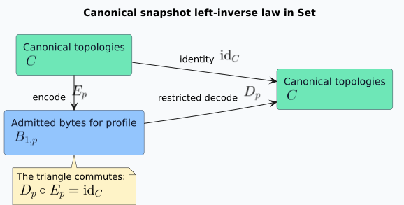

# Canonical snapshot laws

This document states the codec's algebraic structure precisely. It uses the category **Set**, whose
objects are sets and whose morphisms are total functions. A **fiber** is one member of a family
indexed by a base value. A **quotient** identifies source values under an equivalence relation and
retains only their equivalence classes. These definitions are sufficient for the laws below; the
crate does not claim stronger categorical structure that it does not implement.

For standard category, morphism, functor, and composition terminology, see Mac Lane's
*Categories for the Working Mathematician*
([Springer record](https://doi.org/10.1007/978-1-4612-9839-7)).

## Objects and arrows in Set

Let $`C`$ be the set of canonical dense forward compressed sparse row (CSR) topologies. Stable
node labels are deliberately absent: `encode_snapshot<K>` observes only vertex count, forward
offsets, and forward targets, so no injectivity claim applies to arbitrary `K` values.

Fix a semantic profile identifier $`p`$. Let $`B_{1,p}`$ be the set of byte strings admitted by
the exact version 1.0 decoder under profile $`p`$. Encoding and restricted decoding are total
functions, hence morphisms in **Set**:

```math
E_p : C \longrightarrow B_{1,p},
\qquad
D_p : B_{1,p} \longrightarrow C.
```

They satisfy the left-inverse law:

```math
D_p \circ E_p = \mathrm{id}_{C}.
```



Consequently, $`E_p`$ is injective:

```math
E_p(G_1) = E_p(G_2) \Longrightarrow G_1 = G_2.
```

The production decoder accepts an arbitrary byte slice, not merely $`B_{1,p}`$. That wider
operation is a partial mathematical function represented in Rust as a total function into
`Result<CsrGraph<DenseId>, SnapshotError>`. Rejection does not invent a bottom graph and does not
normalize hostile bytes.

## Semantic-profile fibers

Let $`P`$ be the set of semantic-profile identifiers. The admitted representation family is:

```math
\{B_{1,p}\}_{p \in P}.
```

Each $`B_{1,p}`$ is the fiber selected by exact profile comparison. The decoder rejects rather
than moving between fibers. A categorical **fibration** would additionally require a base
morphism and a specified cartesian lifting operation that reindexes values lawfully between
fibers. This crate defines neither operation, so “fiber” here means an indexed subset, not a claim
that the API implements a fibration. A domain adapter may define reindexing after it proves how
profile meanings and node labels transport.

## Enumeration quotient

Let $`L`$ be a finite list of raw directed edges. Define $`L_1 \sim L_2`$ when both lists describe
the same set of in-range directed edges after duplicate removal. Canonical `libvgraph`
construction is the quotient map $`q`$ from raw enumerations to canonical topology:

```math
q(L) = q(\mathrm{permute}(L))
     = q(L \mathbin{+\!+} L).
```

Encoding factors through $`q`$, so insertion order and duplicate multiplicity cannot affect
bytes. Decoding does not compute this quotient over untrusted data: duplicate or decreasing target
words are noncanonical and are rejected.

## Renaming round-trip stability

For a bijection $`r`$ of the dense vertex domain, let $`r_*G`$ rename every edge and restore
canonical row order. The implemented and property-tested law is:

```math
D_p(E_p(r_*G)) = r_*G.
```

This is round-trip stability after lawful renaming. It is not byte invariance; generally:

```math
E_p(r_*G) \ne E_p(G).
```

Calling the law equivariance would require an independently defined action of $`r`$ on admitted
bytes and a commuting square relating that action to $`E_p`$. The crate intentionally does not
define such a byte action. Equal bytes under arbitrary renaming would instead require canonical
graph-isomorphism labeling, which is a different problem with different cost and semantics.

## Tagged digest mapping

The digest input is the tagged tuple:

```math
T(p,b) = \mathrm{schema}_1 \parallel p \parallel
         \mathrm{le}_{64}(|b|) \parallel b.
```

Changing the digest purpose, schema, profile, encoded length, or bytes changes the constructed
preimage. BLAKE3 derive-key mode maps that byte object into a fixed 256-bit digest. This is a
function in **Set**; it is not called a monoid homomorphism because the implementation specifies no
binary operation that hashing must preserve. Structural proofs establish tuple separation, while
cryptographic collision resistance belongs to BLAKE3.

## Composition boundary

The intended compositional path is:

```text
domain facts → stable-label map → canonical graph → snapshot → admitted graph → analysis
```

Each total arrow can be treated as a morphism in **Set** after its source and target sets are made
explicit. Partial boundary operations use `Result`, and sequential composition uses ordinary Rust
function composition with error propagation. `Result` supports monadic composition in the usual
programming sense, but the crate needs no public “monad” or “morphism” trait: imposing those traits
would add vocabulary without strengthening the wire, resource, or admission laws.
