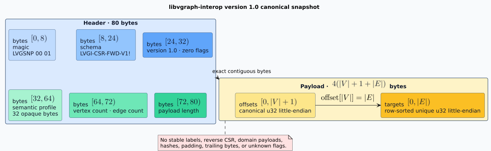

# Canonical snapshot wire format

This is the normative version 1.0 byte grammar. All byte ranges are half-open and zero-based.
Every multibyte integer is unsigned little-endian.

## Constants

| Name | Width | Exact value |
|---|---:|---|
| Magic | 8 bytes | Hex `4c 56 47 53 4e 50 00 01` |
| Schema identity | 16 bytes | ASCII `LVGI-CSR-FWD-V1!` |
| Version | two `u16` words | Major 1, minor 0 |
| Flags | one `u32` word | Zero |
| Header | 80 bytes | Fixed |
| Digest | 32 bytes | BLAKE3 derive-key output |

## Header layout



| Range | Field | Admission rule |
|---|---|---|
| 0..8 | Magic | Exact version-1 magic |
| 8..24 | Schema | Exact schema identity |
| 24..26 | Major | Exactly 1 |
| 26..28 | Minor | Exactly 0 |
| 28..32 | Flags | Exactly zero |
| 32..64 | Semantic profile | Exact caller-expected bytes |
| 64..68 | Vertex count | `u32`, at most the caller limit |
| 68..72 | Edge count | `u32`, at most the caller limit |
| 72..80 | Payload length | Exact count-derived length |

For vertex count $`V`$ and edge count $`E`$, lengths are:

```math
\begin{aligned}
L_{\mathrm{payload}} &= 4(V + 1 + E),\\
L_{\mathrm{snapshot}} &= 80 + L_{\mathrm{payload}}.
\end{aligned}
```

## Payload layout

The payload is contiguous and has no padding:

1. $`V + 1`$ forward offsets encoded as `u32` words.
2. $`E`$ forward targets encoded as `u32` words.

The decoder admits the representation exactly when offsets begin at zero, never decrease, and
end at $`E`$; every target is below $`V`$; and targets in each source row are strictly increasing.
Strict row order simultaneously proves sorting and duplicate absence. The empty graph has one zero
offset and therefore occupies 84 bytes.

## Deterministic error precedence

The ordinary decoder checks these classes in order:

1. initial cancellation at byte position zero;
2. complete-slice byte limit;
3. fixed header availability;
4. magic and schema;
5. exact version and zero flags;
6. semantic profile;
7. payload arithmetic and declared length;
8. exact complete length;
9. vertex, edge, and logical-work limits;
10. a second pre-allocation cancellation observation at byte position zero;
11. fallible offset and target minimum-capacity requests;
12. offset and target copying, with cancellation after every cumulative 1,024 words;
13. cancellation after structural copying;
14. fallible dense-node minimum-capacity request and iterative materialization;
15. canonical CSR validation in one unpolled, stack-safe linear core scan; and
16. cancellation immediately before publication.

The verified decoder checks the byte limit before any cancellation observation or hashing. It then
observes cancellation at digest byte position zero and after every 64 KiB digest chunk, compares the
digest, and begins the ordinary sequence above. The deterministic byte-progress threshold follows
those same checkpoints. A concurrently changing atomic flag makes the observed cancellation point
schedule-dependent; callers must keep the flag true once cancellation is requested until the call
returns. With no changing external control, the listed typed-error precedence is deterministic.
Callers must match `SnapshotError` variants and must not parse display strings. The complete
pseudocode and its preconditions are in the [algorithm specification](../architecture/algorithms.md).

## Digest invocation

The fixed derive-key context is:

```text
libvgraph-interop 2026-09-02 17:22:31 UTC canonical snapshot digest v1
```

Key material is streamed in this exact order:

```text
schema_id[16] || semantic_profile[32] || snapshot_length_le_u64 || snapshot_bytes
```

The reviewed BLAKE3 specification defines derive-key mode as a separate application domain
([specification at commit `ac784c9`](https://github.com/BLAKE3-team/BLAKE3-specs/blob/ac784c9f22a48327782f042ec2f4d8126b3b1744/blake3.tex)).
The tagged tuple prevents accidental cross-schema, cross-profile, length, or payload reuse; it does
not turn a finite hash into a mathematical collision-proof identity.

## Golden vector: empty graph

The semantic profile is 32 zero bytes:

```text
4c5647534e5000014c5647492d4353522d4657442d5631210100000000000000
0000000000000000000000000000000000000000000000000000000000000000
0000000000000000040000000000000000000000
```

Removing line breaks yields the normative 84-byte vector.
Its version-1 digest is
`1b9a21818f39e2f8d5bd71940f2d61413afcc2dbaf4a18c90b13b2d26dc504f9`.

## Golden vector: one edge

The semantic profile bytes are `00`, `01`, through `1f`. The graph contains vertices 0 and 1 and
the directed edge from 0 to 1.

```text
4c5647534e5000014c5647492d4353522d4657442d5631210100000000000000
000102030405060708090a0b0c0d0e0f101112131415161718191a1b1c1d1e1f
0200000001000000100000000000000000000000010000000100000001000000
```

Removing line breaks yields the normative 96-byte vector. The payload contains offsets
`[0, 1, 1]`, followed by target `[1]`. Its version-1 digest is
`2cfdc84873b8c4bfa69fb6094e33bf02e50e1f321982e395263bfd25d96f3565`.

`cargo run --locked --example golden_vectors` regenerates both byte strings and digests from the
public API. The integration test retains the values as independent literals so encoder and decoder
changes cannot update both sides silently.

## Schema evolution

Changing any field width, order, meaning, canonicality rule, digest context, or digest material is
a schema change. A compatible implementation retains every advertised old decoder and migrates by
decoding the old exact schema into a validated graph before encoding the new exact schema. It never
guesses the meaning of unknown fields.
